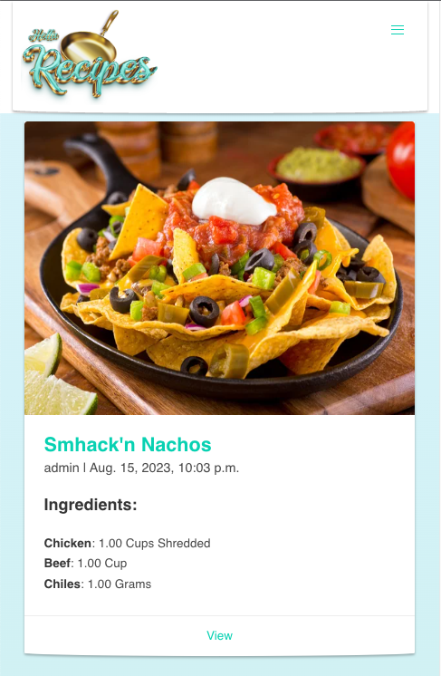
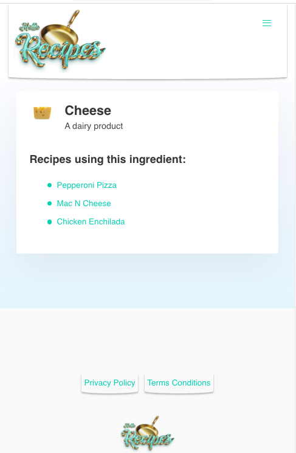
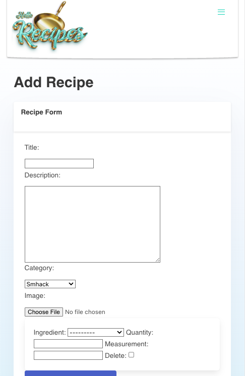
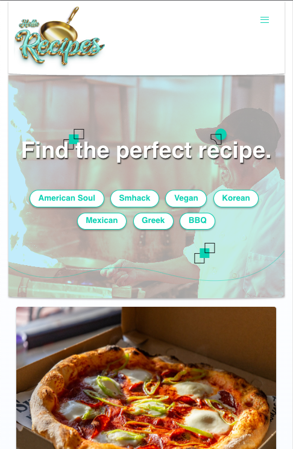
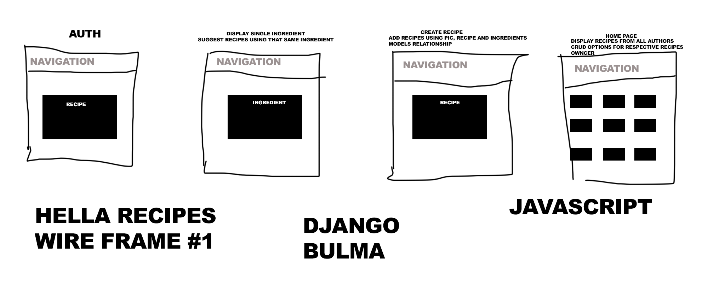

#Hella Recipes Django App

Hella Recipes is a Django-based web application that allows users to browse, create, and manage recipes. Users can also maintain a list of ingredients and associate them with recipes.

🛠 Technologies Used
Backend: Django 4.2.4
Database: SQLite (default with Django, but can be configured for other databases)
Frontend: HTML, CSS, JavaScript (with Django Templates)
Authentication: Django's built-in authentication

🌟 Features
User registration and authentication.
CRUD operations for recipes.
Ingredient management.
Profile management with profile picture uploads.
🚀 Installation & Setup

Clone the Repository:
1. git clone https://github.com/rufuscodes/hella-recipes-django
cd hella-recipes-django
Set Up a Virtual Environment:

2. python -m venv env
source env/bin/activate  # On Windows, use `env\Scripts\activate`
Install Required Packages:

3. pip install -r requirements.txt
Run Migrations:

4. python manage.py migrate
Run the Development Server:

5. python manage.py runserver
6. Open a web browser and navigate to http://localhost:8000/ to access the app.

🌱 Seeding the Database
To seed ingredients into the database:

7. Prepare a text file named ingredients.txt with each ingredient on a new line.
Run the provided seeding script:
python seed_ingredients_script.py

# Pre-development Planning

# Stretch Goals

1. Personalized Recommendations: Implement a recommendation system that suggests recipes based on user preferences, dietary restrictions, or previous recipes they've viewed or liked.

2. Social Integration:
Allow users to share recipes on social media platforms.
Enable users to comment on and like recipes using their social media accounts.

3. Interactive Cooking Mode: A step-by-step cooking guide that users can follow in real-time, with timers for each step.

4. Shopping List Integration: Allow users to add ingredients from a recipe to a shopping list, which they can then print or access from a mobile device.

5. Weekly Meal Planner: Allow users to plan their meals for the week, generating a consolidated shopping list.

🤝 Contributing
Pull requests are welcome. For major changes, please open an issue first to discuss what you would like to change.

📜 License
MIT

